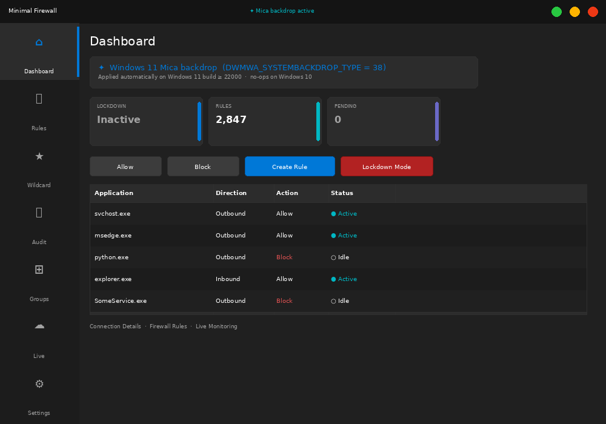
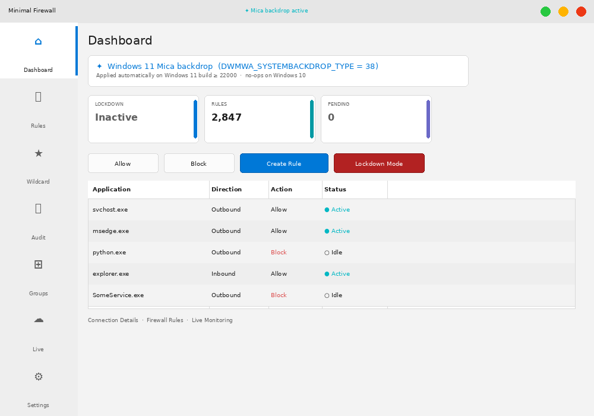
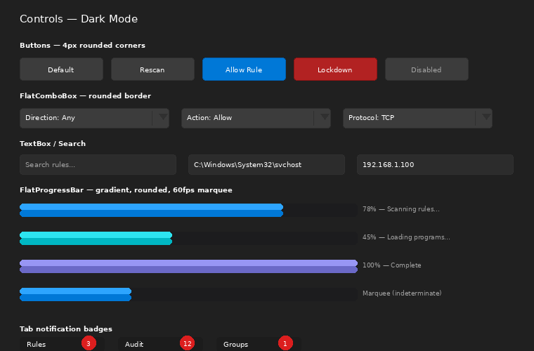
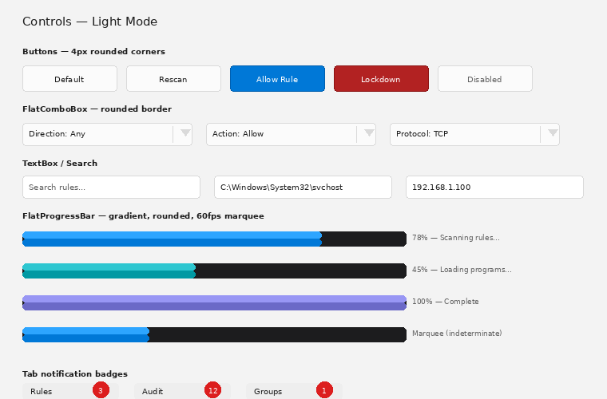
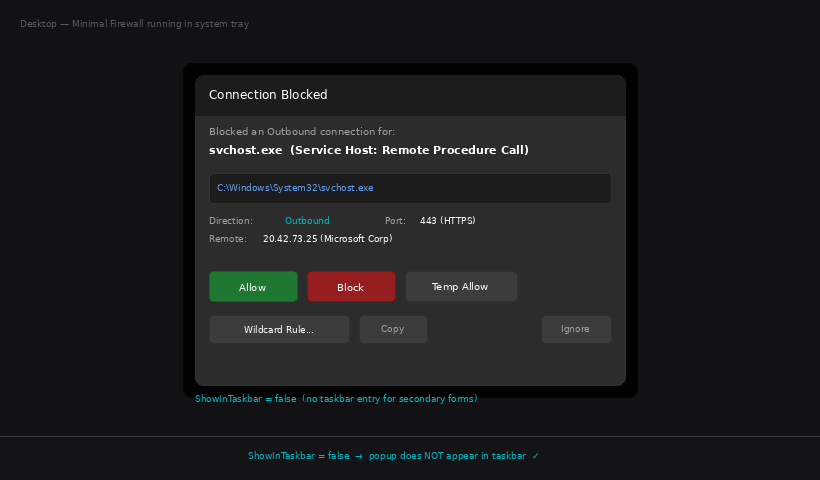
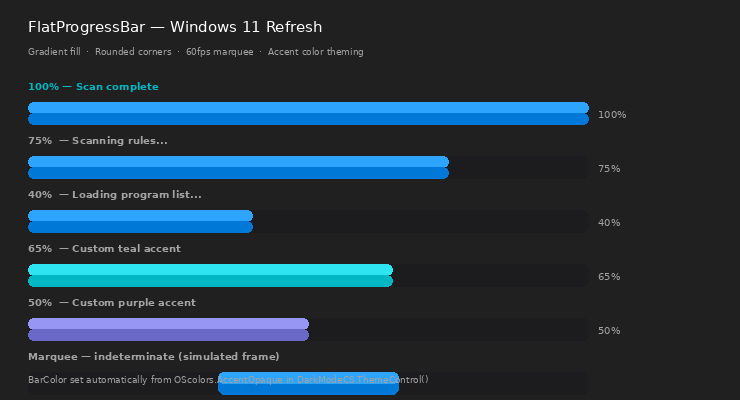

<h1>
  Minimal Firewall
  
</h1>

Minimal Firewall enhances the built-in Windows Firewall to block all unknown network connections by default, giving you complete control. It prompts you for action when an application tries to connect, allowing you to mitigate malware, stop unwanted telemetry, and prevent data leaks. With Minimal Firewall, no application "phones home" without your explicit permission.

Unlike most other Firewall programs, Minimal Firewall acts as a frontend, avoiding enlarging your computer's attack surface by playing around with lower levels of the WFP. Minimal Firewall also has an audit feature to examine new rules added to Windows Firewall. When you use a WFP app, it acts as a filter on top of Windows Firewall. The problem is that Microsoft sets varying levels of importance to its firewall rules (e.g. those changed in group  policy editor or related to Windows Defender may have higher importance). So if the filter and Windows Firewall rules conflict, it's not clear which one supercedes the other. Minimal Firewall avoids this by working directly with Windows Firewall without having to shut off this key part of your Windows security. 

### 💾 Download the latest version [here](https://github.com/deminimis/minimalfirewall/releases)
 
or install with <b>Winget</b> (<i>may be a version behind while waiting to be approved</i>: <pre><code>winget install Deminimis.MinimalFirewall</code></pre>
 

#### Prerequisites
If you don't have .net 10 installed, you can download the desktop runtime from Microsoft [here](https://dotnet.microsoft.com/en-us/download/dotnet/8.0), or via Winget: `winget install Microsoft.DotNet.DesktopRuntime.9`

## User Guide

The program is designed to be intuitive. For a concise user guide, see the [wiki](https://github.com/deminimis/minimalfirewall/wiki/Minimal-Firewall-User-Guide).

## Core Features

- **Lockdown Mode:** The heart of Minimal Firewall. When enabled, it configures the Windows Firewall to block all outbound connections that don't have an explicit "Allow" rule. 
    
- **Real-Time Connection Alerts:** Get instant notifications when a blocked program attempts network access. Choose between interactive pop-ups for immediate action or silent, in-app alerts on the dashboard to review later.
    
- **Simple & Advanced Rule Creation:**
    
    - **Program Rules:** Allow or block applications with a single click.
        
    - **Advanced Rules:** Create detailed rules based on protocol (TCP/UDP/ICMP), local/remote ports, IP addresses, services, and network profiles (Domain, Private, Public).

- **Quarantine Mode (Beta):** Located in the Audit tab, this optional security feature automatically disables any new firewall rules created by third-party applications. These rules remain disabled until you explicitly review and accept them.
        
- **Firewall Auditing:** The Audit tab monitors for rules created, modified, or deleted by other applications. 
    - **Visual Verification:** Changes are color-coded based on digital signatures (Green for trusted, Yellow for third-party, Red for unsigned/unknown).
    - **Batch Management:** Select multiple entries to allow, disable, or delete rules in bulk.
    - **Timeline:** See exactly when a rule was added to your system.
    
- **Live Traffic Monitoring:** The "Live Connections" tab displays all active TCP connections on your system in real-time with optimized polling, showing which process is connected to which remote address.
    
- **Wildcard Rules:** Easily manage applications that update frequently (like web browsers) by creating rules that apply to any executable within a specific folder. Updates to the wildcard list are now reflected immediately.

- **Rule Import & Export**: Save your entire rule configuration (including advanced and wildcard rules) to a single JSON file. This is perfect for backups or migrating your setup to a new computer. Paths are made portable using environment variables (%LOCALAPPDATA%, etc.) for easy sharing. You can choose to either add imported rules to your existing set or completely replace them.

- **Trust Publishers/Digital Certificates**: Automatically allow applications signed with a trusted digital certificate. You can also manage your own list of trusted publishers to automatically allow any software they create.
    
- **Light & Dark Themes:** A clean, modern user interface that's easy on the eyes, day or night, with DPI scaling support for multi-monitor setups.
    
- **100% Local and Private:** Minimal Firewall contains no telemetry, does not connect to the internet, and stores all rules and logs locally in your `%LocalAppData%` folder.
    
- **Portable:** Minimal Firewall is a single executable that requires no installation. All rules are native to Windows Firewall, so no custom drivers or services are left behind.
    

## Why Use Minimal Firewall?

Minimal Firewall offers a secure and integrated approach by managing the native Windows Firewall, eliminating the need for custom drivers or risky system modifications.

|Feature|Minimal Firewall|TinyWall|SimpleWall|Fort Firewall|
|---|---|---|---|---|
|**Size**|~2MB|~2MB|~1MB|~6MB|
|**Portability**|✅|❌|✅|✅|
|**Requires Core Isolation Off?**|No|No|No|Yes|
|**Connection Alerts**|✅|❌|✅|✅|
|**Advanced Rule Editor**|✅|❌|✅|✅|
|**Firewall Change Auditing**|✅|❌|❌|❌|
|**Wildcards**|✅|❌|❌|✅|
|**Open Source**|✅|✅|✅|✅|
|**Avoids low-level filters**|✅|✅|❌|❌|

## Screenshots

### Windows 11 Fluent Design — Dark Mode

### Windows 11 Fluent Design — Light Mode

### Controls — Rounded Buttons · FlatComboBox · FlatProgressBar (Dark)

### Controls — Light Mode

### Connection-Blocked Popup (ShowInTaskbar = false)

### FlatProgressBar — Gradient Fill · Rounded Corners · 60fps Marquee

## FAQ

1. **Do I need to keep the app running?**
    
    - You do not need to keep the app running to ensure the firewall rules are hardened. These are persistent changes until you unlock it in the app. You only need to run the app when you want to authorize a new program or change a rule, or to utilize quarantine mode. Wildcard rules are only automatically added if the app is open (or closed to tray). If the app is closed, any new updates to the wildcard folders will silently fail until you open the app again.
  
2. **How do I completely uninstall Minimal Firewall?**

    - Because the application is portable, you can simply delete the executable file. To remove the configuration files, delete the `MinimalFirewall` folder located in `%LocalAppData%` (you can open this folder quickly via the Settings tab). To clean up the rules it has created, you have two options on the Settings tab: "Delete all Minimal Firewall rules" (removes only app-created rules) or "Revert Windows Firewall" (resets the entire firewall configuration to factory defaults).
  
3. **Does this work with other antivirus or security software?**

   - Yes. Minimal Firewall is designed to be compatible with other security products. It does not install any kernel drivers or low-level services. It exclusively uses the official `NetFwTypeLib` COM library, which is the standard Microsoft API for managing the built-in Windows Firewall. This prevents the types of conflicts that can occur with firewalls that use their own filtering drivers.

## Security by Default

By leveraging the battle-tested Windows Defender Firewall, Minimal Firewall avoids reinventing the wheel. It uses documented Microsoft APIs to ensure stability and security.

- **No Service Required:** Creates persistent Windows Firewall rules, eliminating the need for its own background service.
    
- **No Network Activity:** The application itself makes no network connections. No telemetry, no update checks, no "phoning home."
    
- **Auditing:** Allows you to see if other applications silently add or change rules in the Windows Firewall.
    

### Secure Rule Creation

- Follows Microsoft's [best practices](https://support.microsoft.com/en-us/windows/risks-of-allowing-apps-through-windows-firewall-654559af-3f54-3dcf-349f-71ccd90bcc5c) for firewall management by favoring application-based rules over risky port-based rules.
    
- Rules are program-specific, tied to an executable's path or a UWP app's Package Family Name, preventing malicious programs from impersonating an allowed app on the same port.
    

## Technical Architecture

Minimal Firewall is a **Windows Forms** application written in **C#** on the **.NET 10** platform. It serves as a user-friendly management layer for the native **Windows Firewall with Advanced Security**.

- **Core Interaction:** It uses the `NetFwTypeLib` COM Interop library to interact with the `INetFwPolicy2` interface, which is the standard API for managing Windows Firewall rules and policies.
    
- **Connection Alerting:** It listens for Event ID `5157` ("The Windows Filtering Platform has blocked a connection") in the Windows Security event log. This is a native, efficient way to detect blocked connection attempts without a custom driver.
    
- **Auditing:** It uses a `ManagementEventWatcher` (WMI) to monitor for real-time changes to the `MSFT_NetFirewallRule` class, allowing it to detect when other processes modify the firewall ruleset. It maintains a complete local cache to accurately track rule history and changes.
    
- **Live Traffic:** The live connection monitor uses the `GetExtendedTcpTable` function from `iphlpapi.dll` to retrieve a list of active TCP connections and their associated Process IDs.
    
- **Performance:** The UI utilizes double buffering for smooth data grid rendering and optimized polling for live connections to minimize CPU usage.
    
- **No Drivers:** It does not use any custom kernel drivers, relying entirely on documented Windows APIs for maximum stability and security.

## Special Thanks
For dark theme, Minimal Firewall uses a modified version of [Dark-Mode-Forms](https://github.com/BlueMystical/Dark-Mode-Forms). 
    

## Contributing

Contributions are welcome! Please submit an issue, a discussion, or a pull request. Feel free to drop a question or discussion in the discussions tab. 

## Build Instructions

#### Prerequisites
* Visual Studio Community 2022
  * When installing Visual Studio, make sure you select the ".NET desktop development" workload (which includes Windows Forms).

#### Step 1: Clone this repo
* When you open up Visual Studio, click clone the repo if you haven't already.

#### Step 2: Open the .sln
* Open the `.sln`. It should now build correctly. If not, go to the next steps.

_____

#### Step 3: Install Dependencies
* Once the project is open, right-click on the "Solution 'MinimalFirewall-WindowsStore'" in the Solution Explorer and select "Restore NuGet Packages".
  * If that doesn't work, go to Tools > NuGet Package Manager > Manage NuGet Packages for Solution.... Install the following two packages:
    * Microsoft.Extensions.Caching.Memory
    * System.Management

#### Step 4: Check the COM Reference
* In Solution Explorer, expand the MinimalFirewall-NET8 project, then expand Dependencies > COM. You should see NetFwTypeLib. If it has a yellow warning icon, right-click it and select "Remove". Then, right-click on Dependencies and select Add COM Reference....In the list, find and check the box for "NetFwTypeLib". 

#### Step 5: Build
* Set configuration manager to x64, and build. 

### Thanks to
@shewolf56
@Hanatarou

## License

Minimal Firewall is licensed under the GNU Affero General Public License v3 (AGPL v3). For commercial or proprietary licensing, please contact me.
